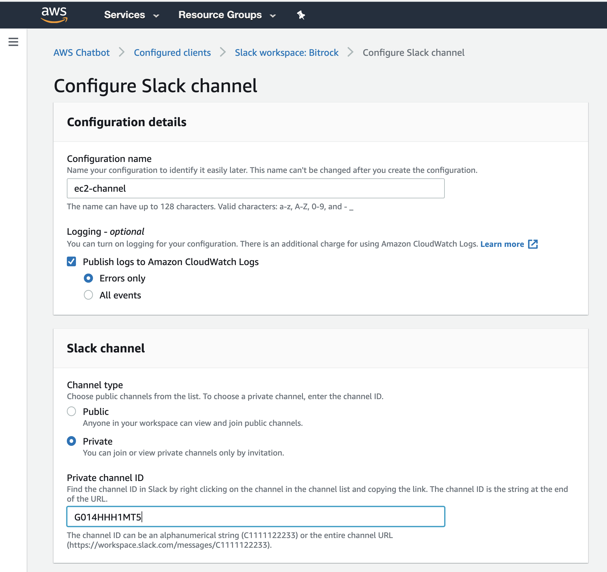
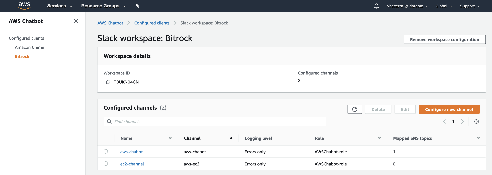
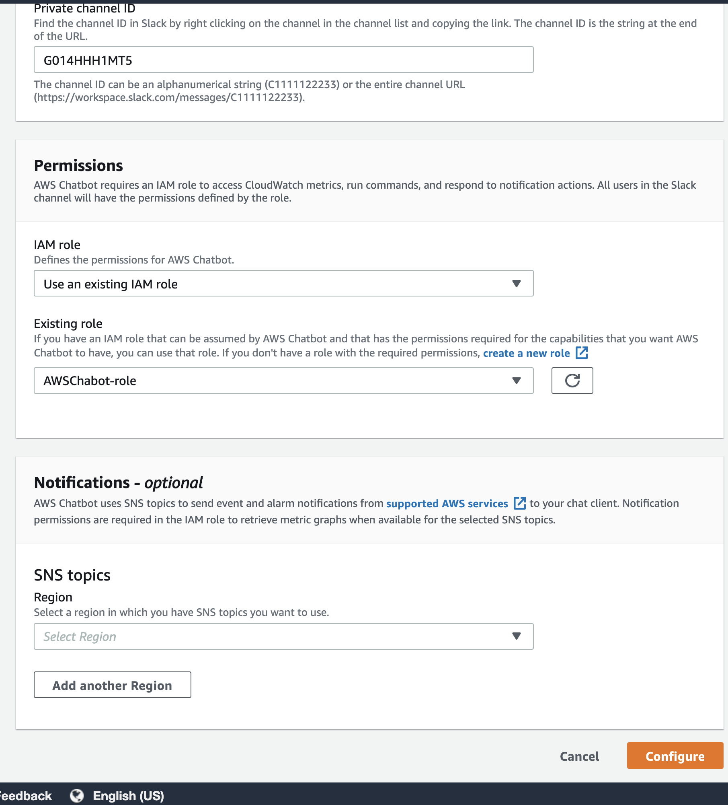

This guide show how to setup aws chabot with your slack to allow you execute remote commands directly to AWS from your slack #channel.

Reference guide: 
https://aws.amazon.com/blogs/devops/running-aws-commands-from-slack-using-aws-chatbot/
https://docs.aws.amazon.com/chatbot/latest/adminguide/chatbot-cli-commands.html

Before start ,  in your slack workspace you need to create a new “private” channel to communicate with aws chabot.

Prerequisites
To follow along with this example, you need an AWS account, as well as a Slack channel to configure with AWS Chatbot.
AWS Chabot is a global services.

-Create a private channel, for team-bitrock.slack.com , was created previously the channel  “aws-chabot”.

1. Configure AWS Chatbot in a Slack channel 
     (showed with a sample below)
   team-bitrock.slack.com   <<<>>>>  AWS 

   AWSChabot-role (following the AWS Administration guide for AWS chabot)

    Role Policies defined:
    AWS Chatbot read-only command permissions policy (allow execute commands from slack channel)
    AWS Chatbot Lambda-Invoke policy (Allow you to invoke lambda functions)

2. Test AWS Chatbot in Slack and get help

To test AWS Chatbot, open the Slack channel that you configured in step 1 and type /invite @aws to invite AWS Chatbot to the channel.

From here you are ready to go.

###### Sample defining a new channel on AWS Chabot #######

STEP 1

First, create a new  channel, in the sample, was created with the name “aws-ec2”  .
Second, very important, copy the private ID of the channel just created.

Next go to AWS console, select AWS Chabot services,(just a first time, you will need to select the client, could be slack or  ).
There is already a client defined previously for BitRock, if you are working for a client in a new project out of “BitRock Organization”,
 you will need to create your client at first.

To continue, select the client “BitRock” and select “Configure Slack Channel”.
Follow the steps showed in the sample, you will need to replace the channel ID with your own channel ID.

IF you are in AWS Bitrock, you already have the IAM role created .
    Select the role “AWSChabot-role”. 
    (If you want to see the policy role, search this role in the  IAM services) 

Save configuration.

After that, you will see the new channel just created.

From here, continue with step 2, invite @aws in your slack channel.
